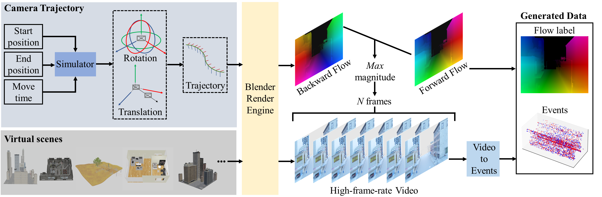

# ADMFlow
The official implementation code repository for [Learning Optical Flow from Event Camera with Rendered Dataset](https://arxiv.org/abs/2303.11011)



## Dataset
### MVSEC
You need download the HDF5 files version of [MVSEC](https://daniilidis-group.github.io/mvsec/download/) datasets. We provide the code to encode the events and flow label of MVSEC dataset.
```python
# Encoding Events and flow label in dt1 setting
python loader/MVSEC_encoder.py --only_event -dt=1
# Encoding Events and flow label in dt4 setting
python loader/MVSEC_encoder.py --only_event -dt=4
# Encoding only Events
python loader/MVSEC_encoder.py --only_event
```
The final tree structure of MVSEC dataset should be：
```
dataset/MVSEC
├── indoor_flying1
│   ├── event
│   ├── flowgt_dt1
│   ├── flowgt_dt4
├── indoor_flying2
│   ├── event
│   ├── flowgt_dt1
│   ├── flowgt_dt4
├── indoor_flying3
│   ├── event
│   ├── flowgt_dt1
│   ├── flowgt_dt4
├── outdoor_day1
│   ├── event
│   ├── flowgt_dt1
│   ├── flowgt_dt4
├── outdoor_day2
│   ├── event
│   ├── flowgt_dt1
│   ├── flowgt_dt4
```
### MDR
This work proposed a Multi Density Rendered (MDR) event optical flow dataset, you can download it from https://pan.baidu.com/s/1iSgGCjDask-M_QqPRtaLhA?pwd=z52j . We also provide code for batch organizing MDR datasets.
```python
python loader/MDR_menage.py -dt=1
python loader/MDR_menage.py -dt=4
```
The final tree structure of MDR dataset should be：
```
dataset/MDR
├── dt1
│   ├── train
│   │   ├── best_density_events1
│   │   ├── best_density_events2
│   │   ├── events1
│   │   ├── events2
│   │   ├── flow
│   ├── test
│   │   ├── 0.09_0.24
│   │   │   ├── events1
│   │   │   ├── events2
│   │   │   ├── flow
│   │   ├── 0.24_0.39
│   │   │   ├── events1
│   │   │   ├── events2
│   │   │   ├── flow
│   │   ├── 0.39_0.54
│   │   │   ├── events1
│   │   │   ├── events2
│   │   │   ├── flow
│   │   ├── 0.54_0.69
│   │   │   ├── events1
│   │   │   ├── events2
│   │   │   ├── flow
```
## Evaluate
### Pretrained Weights
Pretrained weights can be downloaded from 
[Google Drive](https://drive.google.com/drive/folders/15uwhrmUzg3kK3UB6z0Qnht-sGs7Nq23o?usp=sharing).
Please put them into the `checkpoint` folder.

### Test on MVSEC
```python
# Dense evaluation
python test_mvsec.py -dt dt1
python test_mvsec.py -dt dt4
# Sparse evaluation
python test_mvsec.py -dt dt1 -eval
python test_mvsec.py -dt dt4 -eval
```

### Test on MDR
```python
# Dense evaluation
python test_mdr.py -dt dt1
python test_mdr.py -dt dt4
# Sparse evaluation
python test_mdr.py -dt dt1 -eval
python test_mdr.py -dt dt4 -eval
```
## Citation

If this work is helpful to you, please cite:

```
@article{luo2023learning,
  title={Learning Optical Flow from Event Camera with Rendered Dataset},
  author={Luo, Xinglong and Luo, Kunming and Luo, Ao and Wang, Zhengning and Tan, Ping and Liu, Shuaicheng},
  journal={arXiv preprint arXiv:2303.11011},
  year={2023}
}
